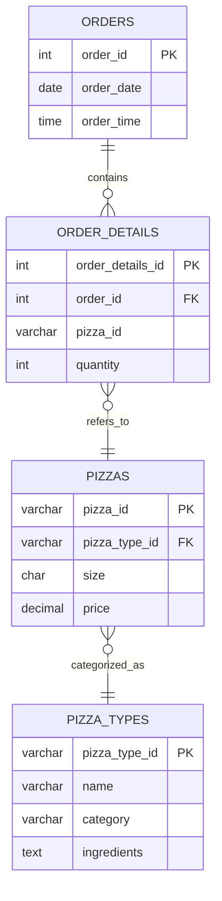

# Pizza Sales Analysis Using MySQL

A comprehensive SQL-based case study focused on analyzing pizza sales, revenue, and performance metrics using **MySQL**.  
This project applies core data analysis techniques to uncover sales trends, revenue patterns, and top-performing pizza types — entirely through SQL queries.

---

## 🗂️ Project Structure

**Folder Layout:**

📁 SQL Queries
→ Contains all SQL queries (Q1–Q13)

📁 Dataset
→ Includes CSV datasets used for analysis

📄 Pizza_Sales_Analysis.pdf
→ Final report with SQL queries and outputs

📄 README.md
→ Project overview and documentation

📄 LICENSE
→ MIT License file for open-source use

---

## 📘 Project Overview

This project uses a pizza restaurant dataset to perform **exploratory data analysis (EDA)** using SQL.  
It demonstrates how SQL can be used for real-world business intelligence — extracting insights, summarizing performance, and supporting data-driven decisions.

Key analytical goals include:
- Tracking order trends and total revenue  
- Identifying best-selling pizzas and most preferred sizes  
- Understanding category-wise and time-based order patterns  
- Analyzing revenue growth and contribution by pizza type  

---

## 🧩 Database Schema (ER Diagram)

---
## 📊 Key Insights

- Total orders placed and total revenue generated  
- Most popular pizza types and sizes  
- Category-wise and hourly distribution of orders  
- Revenue contribution by pizza type and category  
- Cumulative revenue growth analysis  
- Ranking of top 3 pizzas by revenue  

---

## ⚙️ Tools and SQL Concepts Used

**Database:** MySQL  
**Functions Used:** `COUNT()`, `SUM()`, `AVG()`, `RANK()`, `OVER()`  
**Key SQL Concepts:**  
- Table Joins (INNER JOIN)  
- Aggregation and Grouping (`GROUP BY`, `ORDER BY`)  
- Subqueries and Aliases  
- Window Functions for cumulative and ranking analysis  

---

## 📄 Output

All SQL queries and their results are compiled into the final report:  
**[`Pizza_Sales_Analysis.pdf`](./Pizza_Sales_Analysis.pdf)**  

This PDF contains queries, results, and concise insights for each business question.

---

## 👨‍💻 Author

**Lucky Purswani**  
[GitHub Profile](https://github.com/Lucky-Purswani)

---

## 📜 License

This project is licensed under the [MIT License](./LICENSE) © 2025 Lucky Purswani.  
You are free to use and modify this project with proper attribution.
